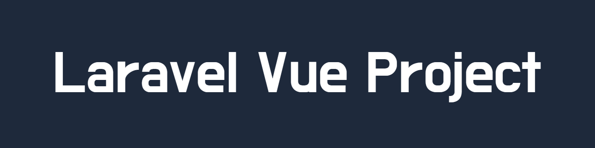

<div id="start" hidden></div>



<h1 align=center>Simple Listings App 📄</h1>

<div align="center">
	
	
	
	
	
	
	
</div>
<div align="center" style="margin-top: 10px;">
	
</div>

## Навигация

- <a href="#описание"><u>Описание</u></a>
- <a href="#превью"><u>Превью сайта</u></a>
- <a href="#использование"><u>Использование</u></a>
- <a href="#проблемы"><u>При неполадках</u></a>

## Описание

**Про сайт**

Сайт для просмотра листингов (постов) с возможностью создавать, редактировать и удалять свои листинги. С помощью фильтрации на главной странице можно как искать интересующие посты в поле поиска или при нажатии на карточке листинга или на его странице по имени или тэгу так и очищать примененные уже фильтры. Чтобы создавать и просматривать свои листинги пользователю нужно подтвердить почту после регистрации и не быть *suspended*. Листинги *suspended* пользователей и не подтвержденные администратором не видны на главной странице, но видны администратору в его панели администратора где можно также просмотреть эти листинги открыв их детальную страницу скрытую от пользователей. Все страницы со списками данных содержат пагинацию.

**Возможности**

<u>Пользователь</u> - может сбросить пароль, изменить свои данные и полностью удалить аккаунт, также имеет панель просмотра своих листингов где может редактировать и удалять посты и отслеживать их подтверждение.

<u>Администратор</u> - те же возможности что и Пользователь + имеет доступ к админ-панели в которой список всех пользователей, в этой таблице админ получает логин и почтовый адрес пользователя, может изменять тип пользователя на один из трёх: *general**, *suspended**, *admin** Отслеживать количество подтверждённых и неподтверждённых листингов и просматривать листинги конкретного пользователя с возможностью подтвердить их в админ-панели или на страницу листинга при нажатии по кнопке.

> **admin* - пользователь с type: admin, является администратором и получает доступ к админ-панели, постам *suspended* пользователей
> 
> **suspended* - приостановленный пользователь, не имеет доступа к панели просмотра своих листингов, удалению и к страницам действий с ними. Все, даже подтверждённые ранее листинги этого пользователя теперь не видны на главной странице.
> 
> **general* - (по умолчанию) обычный пользователь, может работать с листингами.

**Реализация**
##### `Frontend`
`Vue (Composition API)` Отвечает за клиентскую часть и связан с `Laravel` с помощью библиотеки `Inertia.js`.
Используются как стандартный набор функций `Vue` так и те что предлагает `Inertia.js` и дополнительно для генерации url по имени маршрута используется пакет `Ziggy`.
В качестве стилей используется библиотека стилей `Tailwind.css`.
Сборщиком выступает `Vite`.


##### `Backend`
Серверная часть реализована на объекто-ориентированном фреймворке языка программирования `PHP` - `Laravel`. Аутентификация, авторизация, заполнение таблицы, обработка запросов клиента и возврат ответов в виде компонентов с помощью `Inertia.js` всё это внутри `Laravel`

## Превью
**Главная страница**


**Админ панель**


**Админ панель, посты пользователя**


**Страница пользователя**


**Страница создания листинга**


**Панель управления листингами**


**Страница регистрации**


## Использование

> Убедитесь что у вас уже установлен PHP, Composer, Node.js, Git

**После скачивания или клонирования проекта нужно установить backend зависимости:**
```bash
composer install
```
**Установить frontend зависимости:**
```bash
npm install
```

**Скопировать данные из файла .env.example в .env и сгенерировать новый ключ приложения и вставить в APP_KEY:**
```
php artisan key:generate
```

**Далее укажите свой конфиг для настройки БД:**
```
DB_CONNECTION=mysql
DB_HOST=127.0.0.1
DB_PORT=3306
DB_DATABASE=LaravelVueProject
DB_USERNAME=root
DB_PASSWORD=
```
**Запустить миграции для БД:**
```
php artisan migrate
```

**(Опционально) Засеять тестовыми данными БД из фабрик `Laravel`:**
```
php artisan db:seed
```

**Для начала разработки над проектом нужно запустить frontend и backend сервера:**
```
php artisan serve
```
```bash
npm run dev
```

**Локальная разработка**

Для локальной разработки рекомендуется использовать специализированный веб-сервер, такой как Open Server Panel, Laragon, XAMPP или MAMP. Эти инструменты предоставляют комплексную среду разработки, включающую в себя веб-сервер (Apache или Nginx), базу данных (MySQL) и другие компоненты.

**Развёртывание проекта**

После завершения установки и тестирования проект готов к развёртыванию на сервере. Для публикации проекта выполните следующие шаги:
- Скопируйте проект на сервер.
- Настройте базу данных и окружение.
- Запустите проект в продакшен-режиме с помощью команды npm run build и php artisan serve --host=0.0.0.0.
- Дополнительные действия в зависимости от требований

## Проблемы

<details style="margin-bottom: 10px">
	<summary style="border: 1px solid gray; border-radius: 10px; margin-bottom: 10px; padding: 10px; ">
		<b>Текст возможной проблемы</b>
	</summary>
	Текст решения проблемы
</details>

<details style="margin-bottom: 10px">
	<summary style="border: 1px solid gray; border-radius: 10px; margin-bottom: 10px; padding: 10px; ">
		<b>Текст возможной проблемы</b>
	</summary>
	Текст решения проблемы
</details>

<details style="margin-bottom: 10px">
	<summary style="border: 1px solid gray; border-radius: 10px; margin-bottom: 10px; padding: 10px; ">
		<b>Текст возможной проблемы</b>
	</summary>
	Текст решения проблемы
</details>

#### <a href="#start">⬆ Наверх</a>
